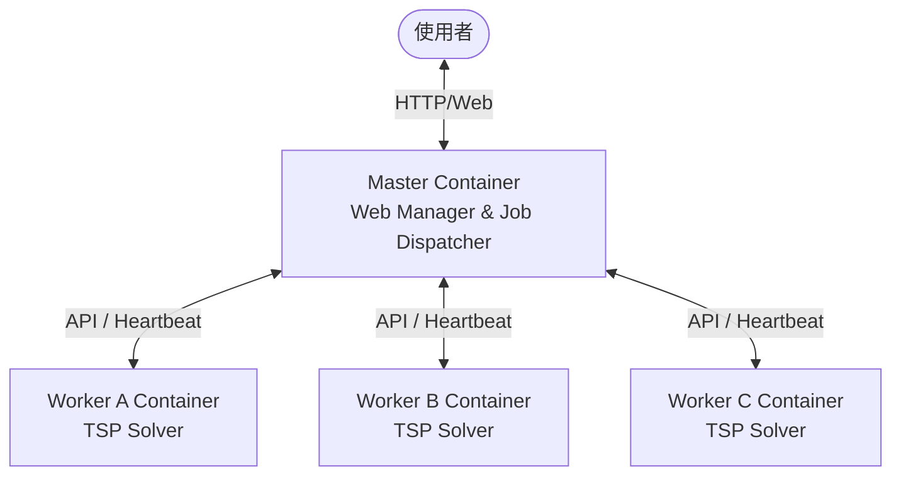
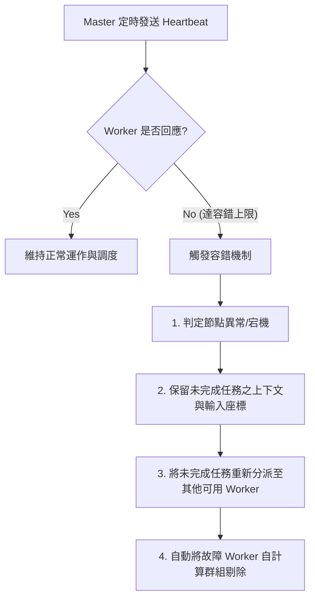

# 分散式 TSP 路徑優化平台 — 系統需求說明書 (Requirement Specification)

本文件依據《TSP\_分散式容器化平台提案書》撰寫，旨在明確定義以容器化技術建構之「分散式 TSP 路徑優化平台」的系統功能與非功能性需求，作為後續系統設計、開發與驗收之基準。

---

## 一、 專案概述 (Project Overview)

### 1.1 專案背景與問題定義

物流配送業務的核心在於如何在多個配送點之間找出成本最低、路徑最短或時間最少的拜訪順序，此即經典的**旅行推銷員問題 (Traveling Salesman Problem, TSP)**。
然而，TSP 屬於 NP-hard 問題，其計算複雜度會隨配送點數量呈指數級快速增加。在實務的物流配送情境中，常需要應對以下挑戰：

1. **即時性需求**：需要在短時間內處理大量訂單、臨時改單或即時路況變化。
2. **單機運算瓶頸**：傳統單機求解方式的運算時間急遽上升，無法滿足即時或近即時 (Near Real-time) 的配送規劃需求。
3. **服務中斷風險**：若單一計算節點發生異常，將導致整個求解任務失敗或服務中斷。

### 1.2 系統目標

本專案旨在建立一套**容器化分散式運算平台**，以解決上述痛點：

- **分散式並行計算**：透過 3 個 Worker 節點並行運算，縮短 TSP 路徑搜尋與評估的時間。
- **高可用與容錯**：具備心跳偵測（Heartbeat）、工作重分配與失效節點自動剔除機制，確保在單一節點故障時服務不中斷。
- **可視化監控介面**：提供即時的任務狀態、節點資源使用率及最終結果彙整畫面，提升平台的可維護性與操作便利性。
- **靈活任務管理**：支援任務排隊、刪除、重新分派等功能。

---

## 二、 系統架構設計 (System Architecture)

本系統採 **Total 4 Containers** 設計，包含 1 個 Master 容器與 3 個 Worker 容器（Worker A、Worker B、Worker C）。

### 2.1 容器角色與職責定義

| 容器名稱     | 角色                            | 主要職責                                                                                                                                                                                                                | 重點輸入/輸出                                                                  |
| :----------- | :------------------------------ | :---------------------------------------------------------------------------------------------------------------------------------------------------------------------------------------------------------------------- | :----------------------------------------------------------------------------- |
| **Master**   | Web Manager & Job Dispatcher | 1. 提供前端可視化操作與監控介面。 2. 接收並驗證使用者提交的任務。 3. 拆分、調度與派送計算工作至可用 Worker。 4. 監控各節點之執行狀態與資源數據。 5. 心跳偵測與容錯機制管理。 6. 彙整並展現最終最佳路徑。 | **輸入**：配送座標資料、任務名稱 **輸出**：任務編號、節點指派、最終彙整路徑 |
| **Worker A** | TSP 計算節點                    | 1. 接收 Master 指派的局部座標/計算任務。 2. 執行 TSP 路徑優化演算法。 3. 定期回傳運算狀態與心跳。 4. 回傳計算結果與運算耗時。                                                                                  | **輸入**：分配之座標資料 **輸出**：局部最佳路徑、計算耗時                   |
| **Worker B** | TSP 計算節點                    | 同上                                                                                                                                                                                                                    | 同上                                                                           |
| **Worker C** | TSP 計算節點                    | 同上                                                                                                                                                                                                                    | 同上                                                                           |

### 2.2 架構優勢

- **邏輯解耦**：Master 與 Worker 職責分離，邏輯清晰，便於維護與橫向擴充。
- **提高吞吐**：多個 Worker 可並行處理不同任務或同任務之不同運算區段。
- **環境一致性**：透過 Docker 容器化部署，確保開發、測試與生產環境完全一致，免除依賴性衝突。

---

## 三、 功能性需求 (Functional Requirements)

### 3.1 任務狀態監控 (Task Status Monitoring)

系統之前端監控介面須即時呈現任務狀態，狀態機需包含以下三種狀態：

1. **排隊中 (Queued)**：任務已提交並寫入佇列，等待 Dispatcher 分配節點。
2. **執行中 (Running)**：任務已分配至特定 Worker 並正在計算。
   - **特殊需求**：畫面需同步標明**由哪一個 Worker 節點負責處理**，以便使用者快速辨識運算位置與進度。
3. **已完成 (Completed)**：運算結束，Master 已彙整並顯示最終最佳路徑與總耗時。

### 3.2 資源數據監看 (Resource Data Monitoring)

為方便開發測試及運行維護，系統須提供節點資源監控畫面：

- **回傳週期**：各節點容器（Master 與所有 Workers）須週期性向監控模組回傳系統資源狀態。
- **數據來源**：整合 `top -bn 1 -i -c` 指令之執行結果。
- **呈現指標**：包含 **CPU 使用率 (%)** 與 **記憶體使用率 (%)**。
- **介面整合**：於同一監控畫面上統整呈現 Master 與 3 個 Worker 的資源數據，以便快速判斷效能瓶頸是否出現在特定節點。

### 3.3 任務管理 (Task Management)

- **取消與刪除**：允許使用者在運算開始前，從排隊佇列（Queue）中刪除錯誤或重複的任務。
- **無效資料過濾**：支援刪除重複訂單或已失效的座標資料，以防浪費運算資源。
- **狀態同步**：任務被刪除後，系統需**同步更新前端狀態與後端工作佇列**，避免殘留過期或錯誤之資料。

### 3.4 任務處理流程 (Task Processing Flow)

標準任務處理流程如下：

1. **提交**：使用者於前端介面輸入/上傳配送座標資料，並為該任務命名。
2. **驗證與排隊**：Master 驗證資料格式，驗證通過後將任務加入排隊佇列。
3. **派送**：Dispatcher 依據節點狀態將任務派送至可用的 Worker。
4. **計算與回傳**：Worker 執行路徑求解並回傳最佳結果與耗時。
5. **彙整與完成**：Master 彙整結果並將狀態更新為已完成。

---

## 四、 高可用性與容錯設計 (High Availability & Fault Tolerance)

為確保系統在生產環境的穩定性，本平台設計了三層容錯思維：

### 4.1 第一層：心跳偵測 (Heartbeat)

- **探測機制**：Master 定時向 Worker 發送健康檢查請求。
- **異常判定**：若在設定時間內沒有收到回應，即可判定該節點可能發生當機、網路中斷或服務異常。
- **設計考量**：用低成本方式快速偵測節點是否可持續承接任務，不追求絕對嚴苛之零誤差。

### 4.2 第二層：工作重新分配 (Job Reallocation)

- **上下文保留**：若 Worker（如 Worker A）執行到一半失去回應，Master 必須保留該尚未完成的任務資訊（包含任務上下文與輸入座標）。
- **任務回收與重派**：Master 將該任務從失效節點的執行清單中回收，並重新指派給 Worker B 或 Worker C。
- **一致性保證**：重新分配時需保留任務上下文與輸入座標，確保結果一致且可追蹤。

### 4.3 第三層：節點自動剔除 (Node Eviction)

- **剔除邏輯**：當連續多次 heartbeat 都無法恢復連線時，系統將自動將該失效節點從可用計算群組中移除。
- **目的**：避免 Dispatcher 持續向故障容器派發新工作，降低重試成本，也讓整體排程行為更穩定。

---

## 五、 非功能性需求 (Non-Functional Requirements)

### 5.1 效能與響應性 (Performance)

- **並行加速**：在 3 個 Worker 並行計算下，相較於單機計算，整體求解時間應有顯著降低。
- **監控延遲**：資源監控數據更新延遲應控制在合理區間，且不應對 TSP 運算本身造成顯著的效能干擾。
- **通訊輕量化**：優先使用輕量 API 設計，減少不必要的頻繁同步。

### 5.2 系統可靠性 (Reliability)

- **無單點故障 (No Single Point of Failure for Workers)**：任一 Worker 節點損壞，系統均能自動復原任務並繼續運作。
- **輸入健壯性**：對於格式錯誤或極端數值的座標資料，系統應予以拒絕並提示錯誤，不應導致 Master 或 Worker 崩潰。

### 5.3 易用性與可讀性 (Usability & Readability)

- **直觀監控**：前端畫面只保留必要指標，細節資訊可展開或另設查詢頁面，避免監控資訊過多影響介面可讀性。
- **視覺化路徑**：最終路徑結果應以直觀的形式展現。

---

## 六、 開發規劃與里程碑 (Roadmap & Milestones)

本專題建議分為四個階段進行開發與推進：

| 階段  | 工作內容                 | 產出                             |
| :---- | :----------------------- | :------------------------------- |
| **1** | **需求與架構設計**       | 任務流程、資料格式、節點角色定義 |
| **2** | **Master / Worker 開發** | 任務分派、求解模組、狀態回報     |
| **3** | **監控與容錯整合**       | heartbeat、重新分配、資源監看    |
| **4** | **展示與驗收**           | 可運行 Demo、報告與簡報素材      |

---

## 七、 風險與對策 (Risks & Mitigations)

| 風險                                 | 對策                                                           |
| :----------------------------------- | :------------------------------------------------------------- |
| **任務過大導致單一節點執行時間過長** | 將任務拆分為可管理的工作單元，或以分批派送降低單一節點壓力。   |
| **節點故障造成中斷**                 | 以 heartbeat 與重分配機制將未完成任務回收並派發至其他 Worker。 |
| **監控資訊過多影響介面可讀性**       | 前端只保留必要指標，細節資訊可展開或另設查詢頁面。             |
| **容器之間通訊延遲**                 | 優先使用輕量 API 設計，並減少不必要的頻繁同步。                |
